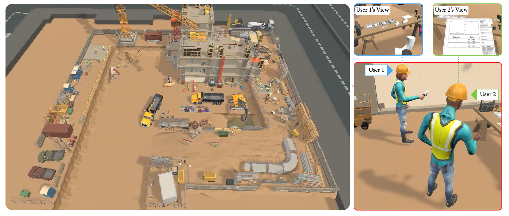
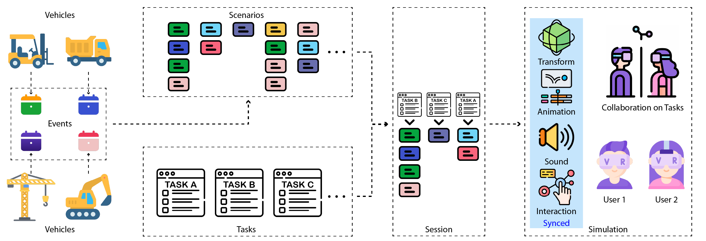

# VRC2-System

This is the official implementation of the paper **Col-Con: A Reconfigurable Virtual Reality Simulation Platform for Exploring Collaborative Behaviors in Construction**.



## Development Environment

- Windows 11
- Unity 2020.3.48f1
- Meta Quest Pro

## Approach Overview



## User Study Scene

Assets/Scenes/System-User-Study.unity

## Citation

```
@misc{yu2024colcon,
      title={Col-Con: A Reconfigurable Virtual Reality Simulation Platform for Exploring Collaborative Behaviors in Construction}, 
      author={Liuchuan Yu and Ching-Yu Cheng and William F Ranc and Joshua Dow and Michael Szilagyi and Haikun Huang and Sungsoo Ray Hong and Behzad Esmaeili and Lap-Fai Yu},
      year={2024},
      eprint={2410.23627},
      archivePrefix={arXiv},
      primaryClass={cs.HC},
      url={https://arxiv.org/abs/2410.23627}, 
}
```